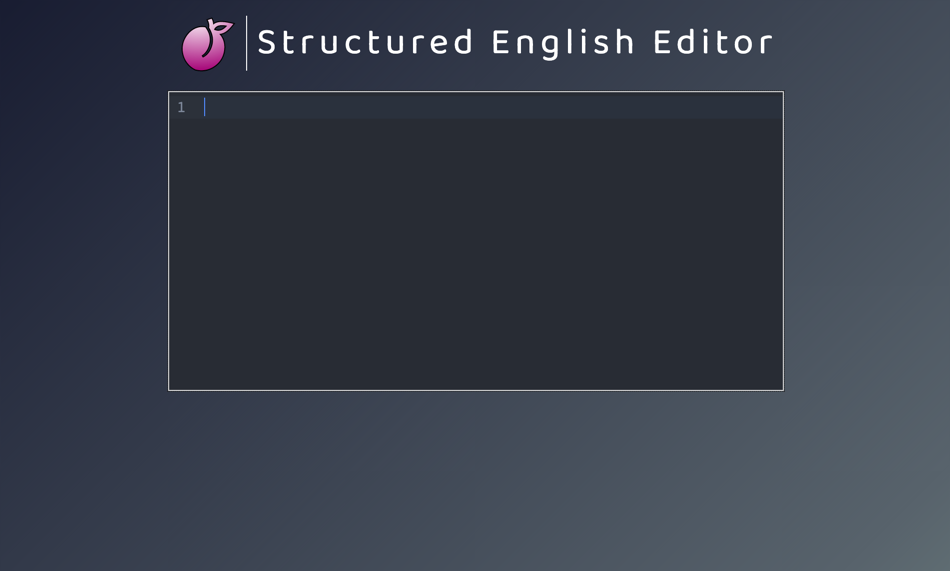

# Structured English Editor language template for Code Mirror 6


# Init Scripts
```bash
# After cloning repo...
node bin/cm.js install
npm run build  # to rebuild language pack and run
npm run dev # to run dev server
```

# Workflow 
_Needs clean-up_

```bash
# ./lang-SEE/src/index.ts -> ./demo/dist/index.ts  
npm run rollup2
# ./demo/demo.ts -> ./demo/static/demo.js
npm run rollup3
```

